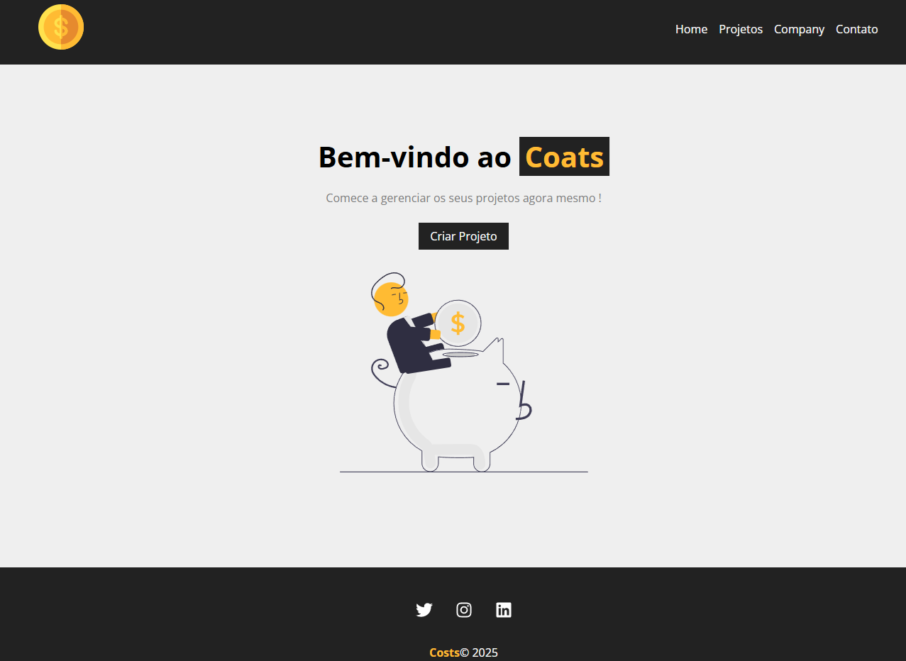

# Dev-Coin

## Techs


  [](https://skillicons.dev)

  ### Print
  


  # :hammer: Funcionalidades

- `functionality `:
- Responsivo.
- Crie o seu projeto , edit e delete através do metodo CRUD


Bibliotecas istaladas:

- react isons : npm install react-icons --save
- react router dom: npm i react-router
- json server: npm i json-server
- npm install -g json-server
  ou
npm install --save-dev json-server
- vite: npm create vite@latest

Instalar dependências:

```js
npm install
```

Rodar projeeto:

```js
npm run dev
```


Arquivo parckage.json adcionei backend json

```js
"scripts": {
    "dev": "vite",
    "backend": "json-server --watch db.json --port 5000",
    "build": "vite build",
    "lint": "eslint .",
    "preview": "vite preview"
  },
```
